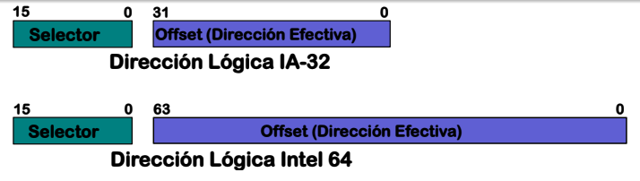
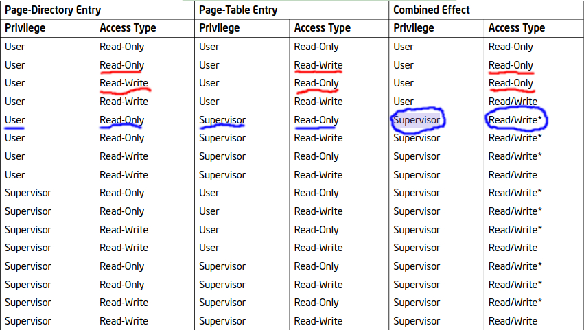

# Parte 3 - Respuestas Teoricas

a)  ¿Cuántos niveles de privilegio podemos definir en las estructuras de
    paginación?

    Tanto a las entradas de la PD como de la PT podemos indicarles:

    - U/S: Modo Usuario o Modo Supervisor (Level 3 o Level 0).

    - R/W: Si puede o no escribir en la memoria controlada por esta estructura.

b)  ¿Cómo se traduce una dirección lógica en una dirección física? ¿Cómo
    participan la dirección lógica, el registro de control `CR3`, el
    directorio y la tabla de páginas? Recomendación: describan el
    proceso en pseudocódigo

    (Pre-Segmentacion):

    Partiendo de la dirección lógica, lo primero que trabaja el procesador es el selector, el offset de la dirección efectiva, se usa recién al final del calculo de la dirección lineal: 
    Para el calculo de la dirección lineal, la operatoria que realiza el procesador es la siguiente: 
        1- El CPU evalúa el estado del bit TI, si TI es 0 (como este caso), buscara el descriptor en la tabla GDT. 
        2- El registro GDTR del procesador contiene en su campo Dirección Base la dirección física en donde comienza la GDT. 
        3- El campo "índice" del selector, referencia su respectivo elemento en la GDT. 
        4- El procesador accede a la dirección física de este elemento guardado en la GDT haciendo el siguiente calculo: 'GDT.base + 8*indice' y lee 8bytes a partir de ahí. 
        5- Luego el CPU reordena la Dirección Base y el limite, y agrupa los atributos. 
        6- La Unidad de protección verifica que el offset contenido en el registro correspondiente de la dirección lógica corresponda a los ófsets validos del segmento de acuerdo al valor del campo "Limite" y de los bits de "Atributos G,  D/B, y ED". También chequea que la operación a realizarse en el segmento corresponda con los "Atributos R y C" si es de código, o "Atributo W" si es de datos, que el código de acceso tenga privilegios necesarios de acuerdo al  DPL del descriptor y por ultimo que este presente (P=1). 
        7- Si todo esto es correcto, finalmente, el procesador suma el valor de offset contenido en la dirección lógica, con la Dirección Base del segmento y conforma la dirección lineal.

    (Pre-Paginacion):
    
    La dirección lógica esta formada por 32 bits:

    31 - 22 (10 bits): Indica el offset en el Page Directory señalado por CR3.
    21 - 12 (10 bits): Indica el offset en la Page Table señalado por la entrada de la Page Directory.
    11 - 0 (12 bits): Indica el offset en la Pagina de 4KB indicada por la entrada de la Page Table.

    Entonces para traducir esta dirección lógica a una física tenemos que:

    - Encontrar la dirección de la Page Directory en el CR3. Son los 20 bits más altos del mismo.
    
    - Una vez sabemos donde esta la Page Directoy, utilizamos el offset indicado en la dirección lógica para encontrar la entrada (PDE). Esta apuntara a la Page Table correspondiente, nuevamente en los 20 bits más altos.
    
    - Una vez localizada la Page Table indicada por la PDE, utilizamos el offset de la dirección lógica para encontrar la entrada (PTE). Esta apuntará a la Pagina de 4KB que estamos buscando, nuevamente en los 20 bits más altos.
    
    - Por ultimo, utilizamos el Offset indicado por la dirección logica en esta Página de 4KB para encontrar ahora si la Dirección Física que estabamos buscando.

c)  ¿Cuál es el efecto de los siguientes atributos en las entradas de la
    tabla de página?

  - `D`: (Dirty) Indica si se escribió a memoria controlada por esta entrada de la PT (PTE).
  - `A`: (Accessed) Indica si se accedió a memoria controlada por esta PTE.
  - `PCD`: (Page Cache Disable) Deshabilita cachear los datos de página asociada.
  - `PWT`: (Page Write-Through) Deshabilita hacer write-back al escribir en la página asociada.
  - `U/S`: (User/Supervisor) Determina si un proceso en modo usuario puede acceder a la memoria controlada por esta PTE.
  - `R/W`: (Read/Write) Determina si un proceso puede escribir a la memoria controlada por esta PTE.
  - `P`: (Present) Indica que ésa traducción es válida.

d)  ¿Qué sucede si los atributos U/S y R/W del directorio y de la tabla
    de páginas difieren? ¿Cuáles terminan siendo los atributos de una
    página determinada en ese caso? Hint: buscar la tabla *Combined
    Page-Directory and Page-Table Protection* del manual 3 de Intel

    - Si en tanto PDE como PTE me indican como privilegio "User" pero difieren en R/W, se dara prioridad a "Read-Only" (Marcado en rojo en la foto).

    - Si alguna de las entradas (Ya sea PDE o PTE) me indica como privilegio "Supervisor", pueden pasar 2 cosas:
        - Si CR0.WP = 0, el hecho de que una de las entradas indique privilegio "Supervisor" permite acceso del tipo "Read-Write" sin importar lo que diga la otra entrada. Esto incluso si ambas entradas me indican "Read-Only", el mero hecho de que una me indique como privilegio "Supervisor" ya resulta en que tenga "Read/Write" como access type (Marcado en azul en la foto).

        - Si CR0.WP = 1; el tipo de acceso quedara determinado por el campo R/W de las entradas, exactamente igual que como se aclaro al principio.

e)  Suponiendo que el código de la tarea ocupa dos páginas y
    utilizaremos una página para la pila de la tarea. ¿Cuántas páginas
    hace falta pedir a la unidad de manejo de memoria para el
    directorio, tablas de páginas y la memoria de una tarea?

    Suponiendo que estas paginas esten continuas y no se pasen del espacio de la tabla; alcanzaria con pedir una PD, una PT y las 2 paginas de codigo de la tarea y una ultima para la pila.

f)  Completen las entradas referentes a MMU de `defines.h` y comprendan
    la función y motivación de dichos defines:

  - `VIRT_PAGE_DIR(X)`: Dada `X` una dirección virtual calcula el índice dentro del directorio de páginas de la PDE asociada.

  - `VIRT_PAGE_TABLE(X)`: Dada `X` una dirección virtual calcula el índice dentro de la tabla de páginas de la PTE asociada.

  - `VIRT_PAGE_OFFSET(X)`: Dada `X` una dirección devuelve el offset dentro de su página.

  - `CR3_TO_PAGE_DIR(X)`: Obtiene la dirección física del directorio donde `X` es el contenido del registro `CR3`.

  - `MMU_ENTRY_PADDR(X)`: Obtiene la dirección física correspondiente, donde `X` es el campo address de 20 bits en una entrada de la tabla de páginas o del page directory

Respuesta en el [<u>*_defines.h_*</u>](src/defines.h#L103-L107)

g)  ¿Qué es el buffer auxiliar de traducción (*translation lookaside
    buffer* o **TLB**) y por qué es necesario purgarlo (`tlbflush`) al
    introducir modificaciones a nuestras estructuras de paginación
    (directorio, tabla de páginas)? ¿Qué atributos posee cada traducción
    en la TLB? Al desalojar una entrada determinada de la TLB ¿Se ve
    afectada la homóloga en la tabla original para algún caso?

    La TLB es una espacio en el que el procesador puede cachear traducciones de direcciones lógicas para asi poder agilizar el proceso de paginación. 
    Cada entrada es una traduccion individual, referenciada por un "page number".

    Según la sección 4.10.2.2 del Vol.3 del Manual de Intel, cada traducción almacenada en la TLB esta formada por los siguientes atributos:

    -	El page number, que referencia a la traducción.
    -	El page frame (dir. fisica correspondiente al page number).
    -	Los permisos de acceso de las entradas de la estructura de paginación (R/W, U/S, etc.).
    -	La dirty flag y memory type correspondientes a la estructura de paginación.

    Es importante invalidar la TLB cuando modificamos las estructuras de paginacion, caso contrario quedarian chacheadas traducciones que estan desactualizadas.
    (4.10.2.2 - Caching Translations in TLBs)

**Parte 3** 

**b)** Es necesario mapear las paginas porque el procesador no puede acceder directamente a direcciones fisicas cuando paginacion esta activada, por eso para leer y escribir en el espacio de memoria virtual, debemos mapear estos a sus respectivas direcciones fisicas. 
Tambien, una vez finalizada la copia de la pagina, debemos unmapearlas porque son un mapeo temporal, ya que, no nos sirve de nada conservar esos datos en memoria una vez que fueron copiados. 
Ambas direcciones virtuales, tanto SRC_VIRT_PAGE como DST_VIRT_PAGE, son las direcciones a donde vamos a mapear las fisicas que nos pasan por argumentos en copy_page, para luego copiar el contenido de src a dst. 
Es necesario obtener los datos del registro CR3 con rcr3(), para que la funcion map y unmap puedan hacer la traducciones de direcciones de manera correcta. De lo contrario, sin la informacion que nos provee los 20 bits mas altos de este registro, no tendrian forma de llegar al directorio de pagina por lo que no se podrian hacer las traducciones de direcciones fisicas a virtuales. 
